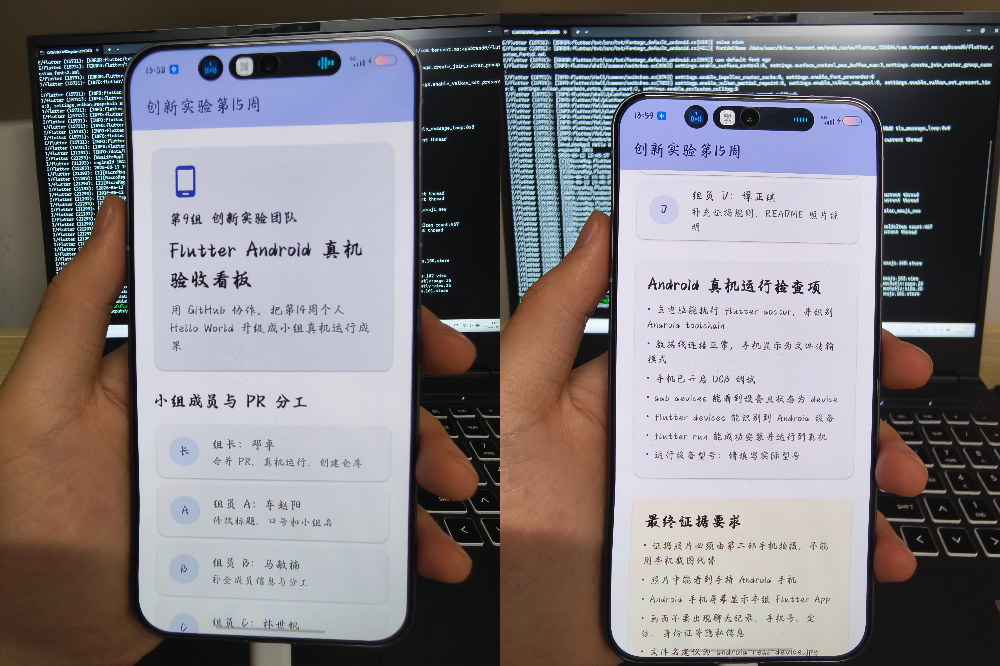

# 第9组创新实验第15周成果

## 小组成员

| 角色 | 姓名 | 任务 | PR 链接 |
| --- | --- | --- | --- |
| 组长 | 邓卓 | 合并 PR、真机运行、创建仓库 | - |
| 组员 A | 请填写 | 标题与口号 | - |
| 组员 B | 请填写 | 成员信息与分工 | - |
| 组员 C | 林世钒 | Android 真机检查项 | - |
| 组员 D | 请填写 | 证据规则、README 照片说明 | - |

## Android 真机检查项

| 检查项 | 要求 | 状态 |
| --- | --- | --- |
| 手机开发者模式 | 已开启 USB 调试 | ☐ |
| USB 连接 | 手机已通过数据线连接电脑 | ☐ |
| 手机授权 | 弹出"是否允许 USB 调试"时点击"允许" | ☐ |
| Flutter 环境 | `flutter doctor` 无报错 | ☐ |
| 依赖完整 | `flutter pub get` 已执行成功 | ☐ |
| 设备识别 | `flutter devices` 能看到你的手机 | ☐ |
| 应用运行 | `flutter run` 能成功安装并启动 App | ☐ |

## Android 真机运行

- 手机型号：请填写实际型号
- 运行方式：`flutter run`
- 运行日期：2026-06-12

## 真机运行照片



> 照片由第二部手机拍摄，显示手持 Android 手机运行本组 Flutter App 的界面。

## 协作流程

1. 组长创建原始仓库 `innovation-week15-team-device-9`
2. 组员 Fork 仓库并创建个人分支
3. 每名组员只修改自己负责的区域
4. 组员提交 Pull Request
5. 组长 Review 并合并
6. 主电脑连接 Android 手机运行最终版本
7. 第二部手机拍摄手持真机照片
8. README 展示分工、PR 和照片

## 运行说明

```bash
# 克隆仓库
git clone https://github.com/xiaoxiaodz/innovation-week15-team-device-9.git
cd innovation-week15-team-device-9

# 获取依赖
flutter pub get

# 运行到 Android 真机
flutter run
```
